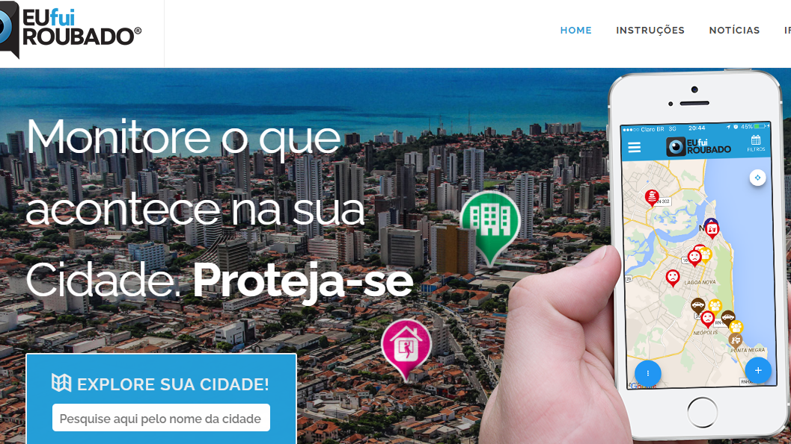
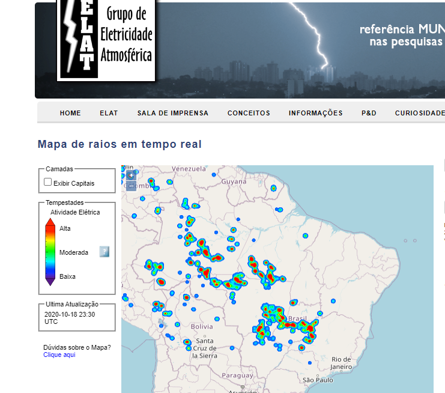
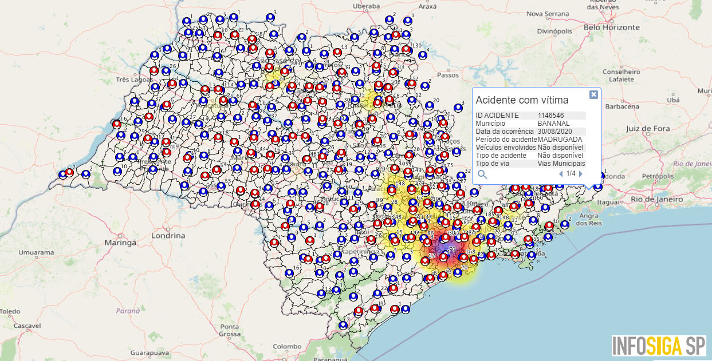
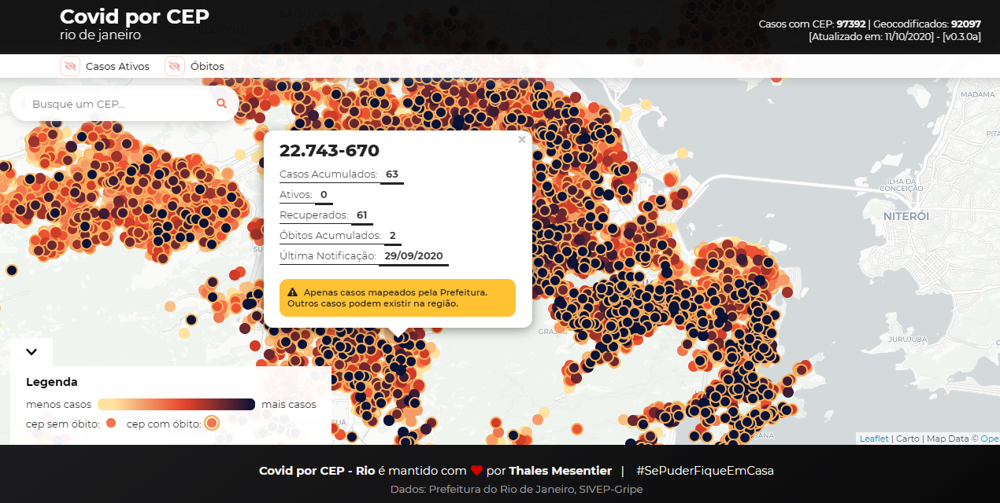
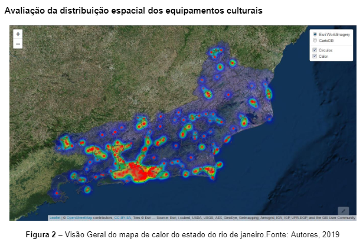
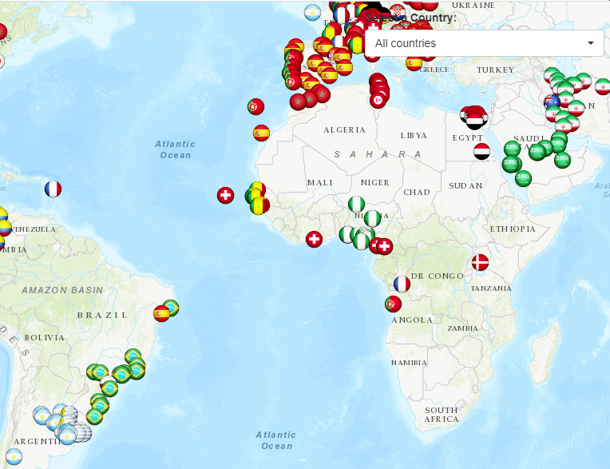
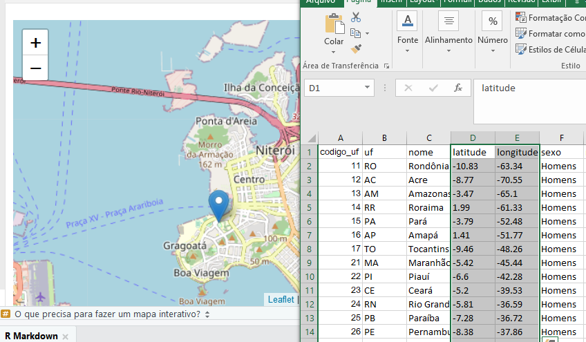

class: middle

# PROFA. LUCIANE ALCOFORADO
  
* Formada em Matemática com mestrado e doutorado na área de Engenharia, iniciei meus estudos da linguagem R em 2006;

* Em 2014 publiquei meu primeiro livro de Introdução ao R pela EDUFF e em 2017 o segundo sobre Visualização de Dados (eu e prof. Ariel);

* Idealizei e coordenei o projeto de extensão [Estatística é com R!](www.estatisticacomr.uff.br), o evento [SER - Seminário Internacional de Estatística com R](www.ser.uff.br);

* Sou uma das organizadoras do grupo [R-Ladies Niterói](https://www.meetup.com/pt-BR/rladies-niteroi/)

### Contato:

- Email: lucianea@id.uff.br

- [LinkedIn](https://www.linkedin.com/in/luciane-alcoforado-4a344a101/)

```{r message=FALSE, warning=FALSE, , out.width="35%", paged.print=FALSE, echo=FALSE, fig.align = 'center'}

```


---

class: middle

# O que é o leaflet

O *leaflet* é uma biblioteca javascript para criação de mapas interativos. O pacote *leaflet* do R torna a tarefa de produzir estes mapas muito fácil e ao alcance de todos.
  
```{r echo=FALSE}

library(leaflet)

m <- leaflet() %>%
  addTiles() %>%  
  addMarkers(lng=-43.1271044, lat=-22.8974292, popup="Nossa UFF")
m  
```


---
class: middle

# Aplicações

Sempre que seu estudo ou processo de tomada de decisão necessitar de uma visualização em mapas:

* Localização de assaltos, roubos, etc

* Localização de queimadas, raios, etc

* Localização de pontos críticos em uma rodovia

* Localização de ocorrência de doenças

* Localização de pontos turísticos

* Localização de pontos de engarrafamento de trânsito, alagamento de ruas, etc

---
class: middle

# Exemplo 1

Criando um aplicativo: Onde fui roubado?

```{r message=FALSE, warning=FALSE, , out.width="95%", paged.print=FALSE, echo=FALSE, fig.align = 'center'}

```

---
class: middle

# Exemplo 2

Mapeando raios no Brasil

```{r message=FALSE, warning=FALSE, , out.width="95%", paged.print=FALSE, echo=FALSE, fig.align = 'center'}

```

---
class: middle

# Exemplo 3

Acidentes de trânsito

```{r message=FALSE, warning=FALSE, , out.width="95%", paged.print=FALSE, echo=FALSE, fig.align = 'center'}

```

---
class: middle

# Exemplo 4

Covid por CEP

```{r message=FALSE, warning=FALSE, , out.width="95%", paged.print=FALSE, echo=FALSE, fig.align = 'center'}

```

---
class: middle

# Exemplo 5

Equipamentos culturais no Estado do Rio de Janeiro

```{r message=FALSE, warning=FALSE, , out.width="95%", paged.print=FALSE, echo=FALSE, fig.align = 'center'}

```

---
class: middle

#Exemplo 6

Aplicativo shiny com os locais de nascimento de todos os jogadores que participaram da copa do mundo em 2018


(https://allezcannes.shinyapps.io/Soccer_squads/)

```{r message=FALSE, warning=FALSE, , out.width="95%", paged.print=FALSE, echo=FALSE, fig.align = 'center'}

```
---
class: middle

# O que precisa para fazer um mapa interativo?

* Uma malha da localidade em questão

* Uma base de dados georeferenciada

* Uma saída html

```{r message=FALSE, warning=FALSE, , out.width="95%", paged.print=FALSE, echo=FALSE, fig.align = 'center'}

```

---
class: middle

# Instalação do pacote


```{r eval=FALSE,  message=FALSE, warning=FALSE, , out.width="95%", include=T, paged.print=FALSE}
install.packages("leaflet")
```


Uma vez instalado, você pode usar este pacote no console R, nos documentos R Markdown e nos aplicativos Shiny.

---

### Código:

```{r message=FALSE, warning=FALSE}
library(leaflet) # Carrega o pacote

m <- leaflet() %>%
  addTiles() %>%  
  addMarkers(lng=-43.1271044, lat=-22.8974292, popup="Nossa UFF") # Cria o objeto mapa denominado "m"
m  # Imprime o mapa
```
---
```{r echo=FALSE, message=FALSE, warning=FALSE}
m  # Imprime o mapa
```
---
class: middle

# Banco de Dados

É necessário uma base de dados contendo latitude e longitude de cada elemento observado.

Exemplo:

Coordenadas geográficas Niterói:

**Latitude: -22.8808, Longitude: -43.1043**

---
  
### Código

Com 3 linhas de código, vamos fazer nosso primeiro mapa da web interativo!
  
```{r message=FALSE, warning=FALSE}
library(leaflet) # Carrega o pacote

m <- leaflet() %>%
  addTiles() %>%  
  addMarkers(lng=-43.1043, lat=-22.8808, popup="Niterói") #cria o objeto mapa

m  # Imprime o mapa
```

---
```{r echo=FALSE, message=FALSE, warning=FALSE}
m  # Imprime o mapa
```
---

#Lendo uma base de dados georeferenciada

```{r  message=FALSE, warning=FALSE}
library(readr)
library(dplyr)
library(leaflet)

dados1 <- read_csv2("dados1.csv")

head(dados1)

head(dados1$nome)

dados1$nome <- iconv(dados1$nome) #corrige os nomes

head(dados1$nome)


```
---
#O mapa

```{r message=FALSE, warning=FALSE}
dados1H = dados1 %>% filter(sexo == "Homens")

m <- leaflet(dados1H) %>%
  addTiles() %>%  
  addMarkers(lng=~longitude,
             lat=~latitude,
             label = ~as.character(nascidos_2018)) #cria o objeto mapa

m  # Imprime o mapa


```

---
```{r echo=FALSE, message=FALSE, warning=FALSE}
m  # Imprime o mapa
```
---


#Círculo como marcador de pontos

O raio do círculo pode ser ajustado de acordo com alguma variável numérica

```{r  message=FALSE, warning=FALSE}

dados1M = dados1 %>% filter(sexo == "Mulheres")

m <- leaflet(dados1M) %>%
  addTiles() %>%  
  addCircles(lng=~longitude,
             lat=~latitude,
             label = ~as.character(nascidos_2018),
             color = "red",
             radius = ~nascidos_2018 ) #cria o objeto mapa

m  # Imprime o mapa
```
---
```{r echo=FALSE, message=FALSE, warning=FALSE}
m  # Imprime o mapa
```
---

class: middle

#Cria um agrupamento dos pontos

```{r message=FALSE, warning=FALSE}
dados2 <- read_csv2("dados2.csv")
dados2$nome <- iconv(dados2$nome) #corrige os nomes
head(dados2)

m <- leaflet(dados2) %>% 
  addTiles() %>% 
  addMarkers(lng = ~longitude,
             lat = ~latitude,
             popup = ~nome,
             clusterOptions = markerClusterOptions())
m
``` 
---
```{r echo=FALSE, message=FALSE, warning=FALSE}
m  # Imprime o mapa
```
---

#Customizando os ícones

```{r}
icon.pop <- awesomeIcons(icon = "users",
                           markerColor =
                           ifelse(dados2$Regiao =="NORTE",
                                                "green",
                                  ifelse(dados2$Regiao =="SUL",
                                         "blue", "red")),
                           library = "fa")

m <- leaflet(dados2) %>% addTiles() %>%
  addAwesomeMarkers(~longitude, ~latitude, 
                    icon = icon.pop,
                    label = ~paste0(media_moradores_2019,", ", uf))
m
```
---
```{r echo=FALSE, message=FALSE, warning=FALSE}
m  # Imprime o mapa
```
---
#Filtrando dados

```{r}

#Filtrando Região Norte

dados = dados2 %>% 
  filter(Regiao == "NORTE")

m <- leaflet(dados) %>% addTiles() %>%
  addAwesomeMarkers(~longitude, ~latitude, 
                    icon = icon.pop,
                    label = ~paste0(media_moradores_2019,", ", uf))
m
```
---
```{r echo=FALSE, message=FALSE, warning=FALSE}
m  # Imprime o mapa
```
---

# Onde obter a latitude e longitude das cidades do Brasil?

(https://www.ibge.gov.br/geociencias/organizacao-do-territorio/malhas-territoriais.html)

(https://www.ipea.gov.br/ipeageo/malhas.html)

(https://community.qlik.com/t5/Qlik-Brasil/Municipios-do-Brasil-com-Latitude-e-Longitude/td-p/1480217?attachment-id=66267)

(https://github.com/kelvins/Municipios-Brasileiros)

```{r eval=FALSE, include=FALSE}
#library(rgdal)
# maptools::readShapePoly
br <- readShapePoly("./shapefiles/brasil/BRA_adm_shp/BRA_adm0.shp") # 0: país, 1: estados, 2: municípios
estados1 <- readShapePoly("./shapefiles/brasil/BRA_adm_shp/BRA_adm1.shp") # 0: país, 1: estados, 2: municípios
cidades <- readShapePoly("./shapefiles/brasil/BRA_adm_shp/BRA_adm2")
biomas <- readShapePoly("./shapefiles/brasil/BR_BIOMAS_IBGE.shp")
# rgdal::readOGR
estados <- readOGR("./shapefiles/brasil/BRA_adm_shp/", "BRA_adm1")
```

---

##Efeito de agrupamento nos 5570 Municípios do Brasil

###Botão de localização

<small>
```{r message=FALSE, warning=FALSE}
dados2 <- read_csv2("nasc_vivos_2018_municipios.csv")
dados2$nome <- iconv(dados2$nome) #corrige os nomes
head(dados2)

m <- leaflet(dados2) %>% 
  addTiles() %>% 
  addMarkers(lng = ~longitude,
             lat = ~latitude,
             popup = ~nome,
             clusterOptions = markerClusterOptions()) %>%
    addEasyButton(easyButton(icon="fa-crosshairs",
                             title = "Localize-me",
                             onClick=JS("function(btn, map){ map.locate({setView: true}); }")))
m

```
---

```{r echo=FALSE, message=FALSE, warning=FALSE}
m  # Imprime o mapa
```
---

#Efeito mapa de calor

```{r message=FALSE, warning=FALSE}
library(leaflet.extras)

head(dados2)

m <- leaflet(dados2) %>% 
  addTiles() %>% 
  addMarkers(lng = ~longitude,
             lat = ~latitude,
             popup = ~paste0(nome,", ",NASC_VIVOS_2018),
             clusterOptions = markerClusterOptions()) %>% 
  addHeatmap(lng = ~longitude,
             lat = ~latitude,
             intensity = ~NASC_VIVOS_2018,
             blur = 20, max = 0.05, radius = 15 )
m

```
---

```{r echo=FALSE, message=FALSE, warning=FALSE}
m  # Imprime o mapa
```
---


# E se eu tiver o endereço, como obter latitude e longitude?


Felipe Lima criou um banco de dados Postgres/MySQL com todas as cidades e estados brasileiras, incluindo ruas, latitudes, longitudes e CEPs.

(https://github.com/felipecsl/brazil.db)

---
# Encerramento

Fontes

<small>
* http://rstudio.github.io/leaflet/markers.html

* https://rpubs.com/mattdray/basic-leaflet-maps

* https://www.earthdatascience.org/courses/earth-analytics/get-data-using-apis/leaflet-r/

* https://www.curso-r.com/tags/leaflet/

* http://www.estatisticacomr.uff.br/?p=749
</small> 

  

                  Agradecemos a participação de todos!
  

```{r message=FALSE, warning=FALSE, , out.width="35%", paged.print=FALSE, echo=FALSE, fig.align = 'center'}

```

<small> © 2020 PROFA. LUCIANE ALCOFORADO/UFF, Agenda Acadêmica</small> 